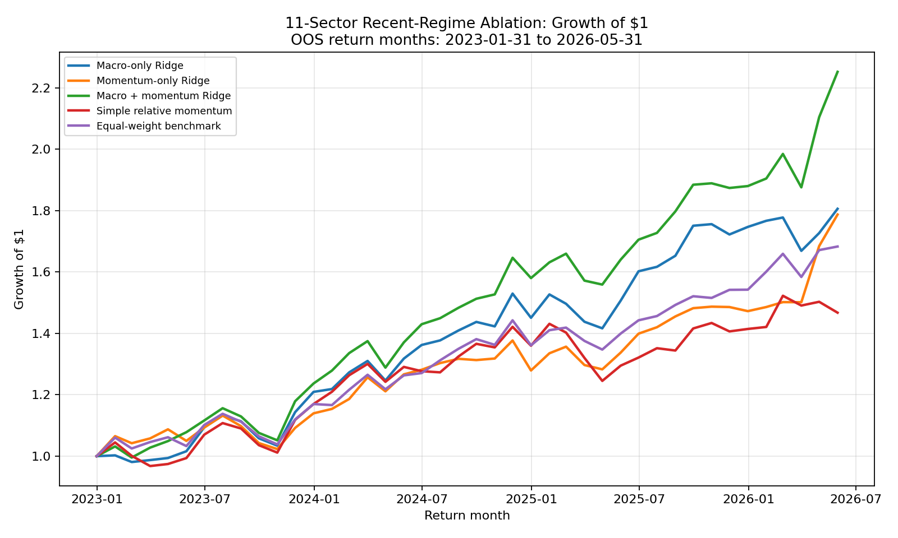
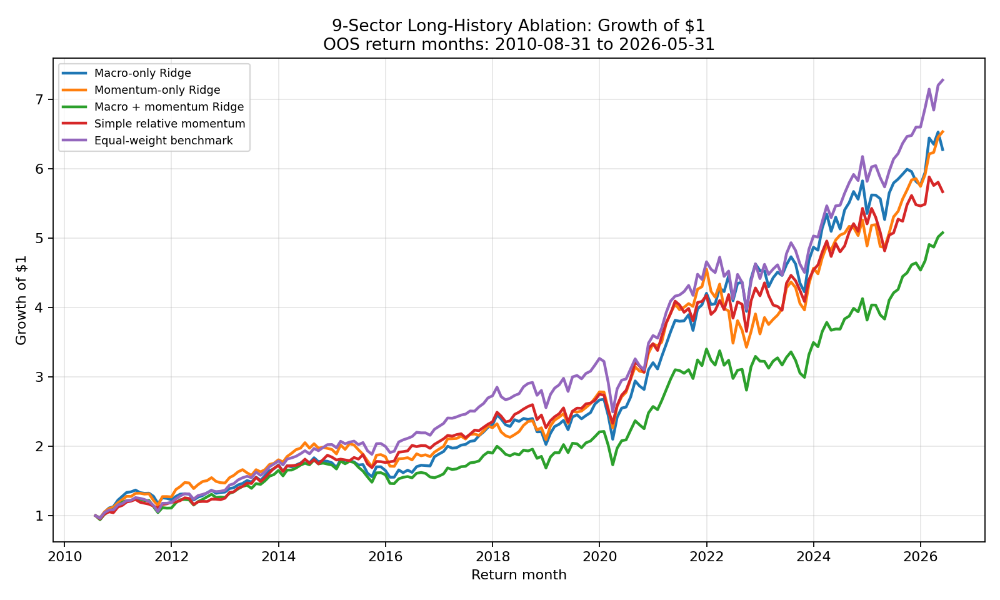
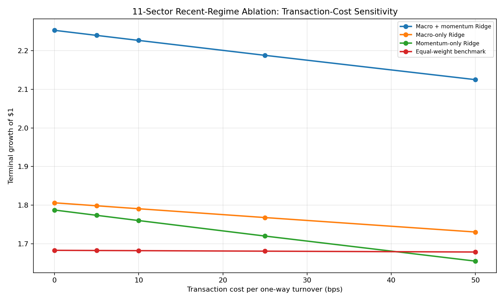
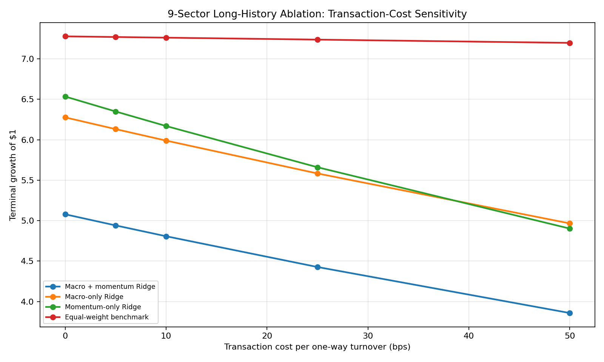

# Macro-Factor Sector Ranking Model

## Overview

This project ranks U.S. sector ETFs using macroeconomic indicators and sector-specific momentum signals. It uses leakage-controlled monthly walk-forward evaluation to compare active sector-ranking models against a diversified equal-weight sector benchmark.

The results are intentionally presented as regime-dependent research findings, not as proof of a universally superior or production-ready trading strategy.

## Key Findings

- Recent 11-sector scope: `macro_plus_momentum_ridge` achieved a 125.24% net cumulative return versus 68.32% for equal weight over 41 out-of-sample months.
- Recent 11-sector transaction-cost robustness: the combined model remained ahead of equal weight even at 50 bps one-way transaction-cost assumptions.
- Long-history 9-sector scope: equal weight achieved a 627.75% cumulative return, while the strongest active variant, `momentum_only_ridge`, achieved 553.38%.
- Honest interpretation: macro and momentum signals showed recent-regime value, but active strategies did not consistently outperform across the longer sample.

## Research Question

Can macroeconomic conditions and sector momentum signals improve next-month sector ETF ranking relative to a simple equal-weight benchmark?

## Sector Universe

The main 11-sector scope includes all sector ETFs in the universe. The 9-sector long-history robustness scope excludes XLC and XLRE because their shorter inception histories reduce the available long sample.

| Ticker | Sector | 11-Sector Scope | 9-Sector Long-History Scope |
| --- | --- | --- | --- |
| XLB | Materials | Yes | Yes |
| XLC | Communication Services | Yes | No |
| XLE | Energy | Yes | Yes |
| XLF | Financials | Yes | Yes |
| XLI | Industrials | Yes | Yes |
| XLK | Technology | Yes | Yes |
| XLP | Consumer Staples | Yes | Yes |
| XLRE | Real Estate | Yes | No |
| XLU | Utilities | Yes | Yes |
| XLV | Health Care | Yes | Yes |
| XLY | Consumer Discretionary | Yes | Yes |

## Data Sources

- Sector ETF adjusted prices are downloaded with `yfinance`.
- Macroeconomic series are downloaded from FRED.
- Raw and processed datasets are intentionally excluded from Git.
- Users must provide their own local FRED API key in `.env`.

No real API key is included in this repository.

## Macro Feature Design

| Feature | Source Series | Transformation | Information Availability Rule | Interpretation |
| --- | --- | --- | --- | --- |
| `indpro_yoy` | INDPRO | 12-month percentage change * 100 | Shifted by 1 calendar month | Industrial activity growth |
| `unemployment_change_3m` | UNRATE | 3-month difference | Shifted by 1 calendar month | Labor-market deterioration or improvement |
| `inflation_yoy` | CPIAUCSL | 12-month percentage change * 100 | Shifted by 1 calendar month | Consumer inflation pressure |
| `m2_yoy` | M2SL | 12-month percentage change * 100 | Shifted by 1 calendar month | Money-supply growth |
| `fedfunds_level` | FEDFUNDS | Level | Shifted by 1 calendar month | Short-rate policy stance |
| `treasury_10y_level` | GS10 | Level | Shifted by 1 calendar month | Long-rate level |
| `yield_curve_spread` | T10Y2Y | Level | Current completed month-end observation | Yield-curve slope |
| `credit_spread` | BAA10Y | Level | Current completed month-end observation | Corporate credit-risk compensation |
| `vix_level` | VIXCLS | Level | Current completed month-end observation | Equity-market volatility/risk aversion |

Slow-release economic features are lagged conservatively before model alignment. Market-based features use completed month-end observations. Standard FRED downloads may include revised historical values, so a stricter advanced version would use ALFRED vintage data for point-in-time macro feature construction.

## Leakage-Control Design

- Incomplete current calendar months are excluded from processed monthly datasets.
- Macro release lags are applied before features are aligned with prediction targets.
- Targets are next-calendar-month sector ETF returns.
- Rolling sector momentum and volatility features use only trailing realized monthly returns through the feature month.
- `StandardScaler` is fit only on training rows inside each walk-forward loop.
- Random train-test splitting is never used.
- All ablation strategies use identical out-of-sample rows and realized target months.

## Modeling Approach

The modeling framework fits one Ridge Regression model per sector, then ranks sectors by predicted next-month returns.

- Baseline model: 9 common macro features.
- Momentum-only model: 4 ticker-specific trailing momentum and volatility features.
- Combined model: 13 features per sector, consisting of 9 macro features plus that sector's 4 ticker-specific features.
- Simple relative-momentum rule: no regression model, ranks sectors by 6-month relative momentum.
- Equal-weight benchmark: average realized return across the sector universe.
- Strict same-row ablation experiment: compares macro-only, momentum-only, combined, simple momentum, and equal-weight strategies over identical prediction dates.

## Public Results



In the recent 11-sector scope, the combined macro-plus-momentum Ridge model outperformed the equal-weight benchmark over the tested out-of-sample period. This is the strongest result in the project, but it covers a short recent sample.



In the longer 9-sector scope, equal weight remained the strongest overall strategy. This suggests the active signals were not consistently robust across the longer market history.



The recent 11-sector combined model remained ahead of equal weight across the tested transaction-cost scenarios, including 50 bps per one-way turnover.



In the long-history 9-sector scope, transaction costs reinforce the weaker active-strategy conclusion because active strategies already trailed equal weight before costs.

## Transaction-Cost Analysis

The transaction-cost analysis uses drift-adjusted one-way portfolio turnover. The first out-of-sample portfolio-establishment cost is excluded and disclosed. For each later rebalance, prior target weights are drifted forward using realized sector returns, normalized, and compared with the next target weights.

The net return formula is:

```text
net_monthly_return = (1 - cost_fraction) * (1 + gross_monthly_return) - 1
cost_fraction = one_way_turnover * transaction_cost_rate
```

Tested transaction-cost assumptions are 0, 5, 10, 25, and 50 bps per one-way turnover. The recent 11-sector combined model remains ahead at 50 bps, while long-history active strategies trail equal weight even before costs.

## Project Structure

```text
src/                  Reproducible data, feature, model, and reporting scripts
reports/              Public GitHub charts, summary tables, and results summary
data/raw/             Ignored raw local datasets regenerated by scripts
data/processed/       Ignored processed local datasets regenerated by scripts
outputs/              Ignored intermediate analysis figures
notebooks/            Optional exploratory notebooks
.env.example          Safe local environment template
requirements.txt      Python package requirements
```

Ignored local datasets are regenerated by the scripts below.

## Reproduction Instructions

Set up the environment in Windows PowerShell:

```powershell
python -m venv .venv
.venv\Scripts\Activate.ps1
python -m pip install -r requirements.txt
Copy-Item .env.example .env
```

Edit `.env` locally and add your own FRED key:

```text
FRED_API_KEY=your_fred_api_key_here
```

Run the pipeline:

```powershell
python src/download_sector_prices.py
python src/download_macro_data.py
python src/build_model_dataset.py
python src/run_baseline_model.py
python src/build_enhanced_model_dataset.py
python src/run_enhanced_model.py
python src/run_feature_ablation.py
python src/run_transaction_cost_analysis.py
python src/generate_public_report_assets.py
```

## Limitations

- Results are not investment advice.
- The 11-sector out-of-sample period is short.
- Performance is regime-dependent.
- ETF inception-date differences affect the available sample for XLC and XLRE.
- Standard FRED series may include revised historical values.
- The transaction-cost analysis does not decompose taxes, bid-ask spreads, market impact, or slippage beyond scenario costs.
- No hyperparameter search or complex-model optimization is performed.
- The project makes no claim of deployable alpha.

## Future Improvements

- Use ALFRED vintage macro data for stricter point-in-time testing.
- Compare expanding versus rolling training windows.
- Explore regime-switching models.
- Add richer transaction-cost estimates.
- Use cross-validation methods designed for time series.
- Add robustness tests while avoiding data snooping.

## Disclaimer

This project is for educational and research purposes only and is not investment advice.
